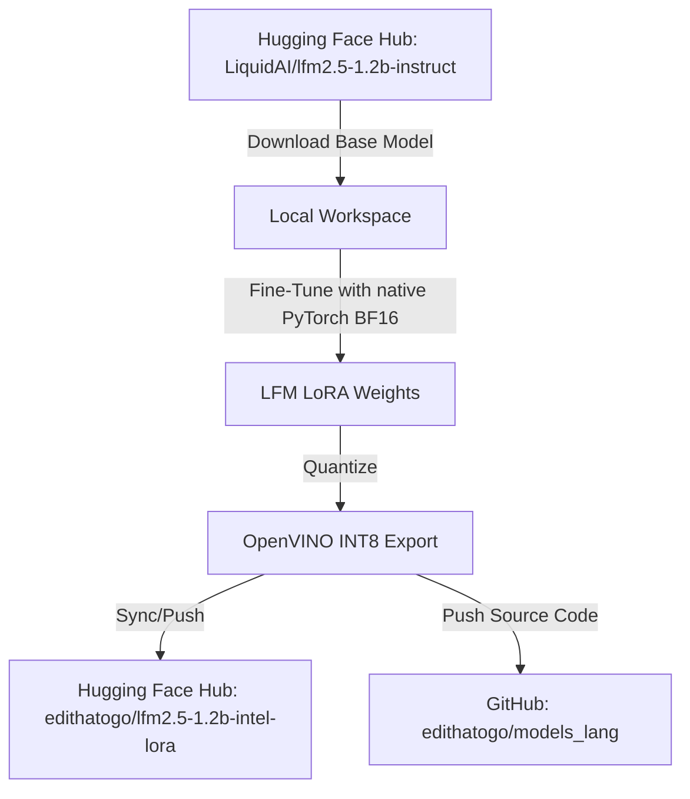

# Track Spec: Intel Chip Optimization Fine-Tuning (LFM-1.2B)

## Overview
This track addresses the concrete fine-tuning and optimization steps for the local **`LiquidAI/lfm2.5-1.2b-instruct`** base model on Intel architecture. The main objective is to use native PyTorch for training on this Windows host and export the model to INT8 OpenVINO for local CPU inference. Intel Extension for PyTorch (IPEX) is legacy optional and only applies in a compatible Linux runtime.

## Requirements (MoSCoW)
*   **Must Have:**
    *   Pull base model `LiquidAI/lfm2.5-1.2b-instruct` from Hugging Face Hub.
    *   Enable native PyTorch BF16/FP32 training with deterministic fallback when IPEX is unavailable.
    *   Configure LoRA/QLoRA adapter configurations matching the LFM structure.
    *   Quantize the final model to INT8 using OpenVINO NNCF.
*   **Should Have:**
    *   Dynamic prompt padding to minimize CPU overhead.
*   **Could Have:**
    *   IPEX optimization on Linux with a pinned compatible PyTorch/IPEX pair.
    *   OpenVINO CPU cache enabled to speed up subsequent loads.
*   **Won't Have:**
    *   Inference on discrete GPU clusters (CPU only).

## Data Contracts
*   **Input Data Contract:**
    ```json
    {
      "source": "huggingface_dataset",
      "format": "parquet/jsonl",
      "schema": {
        "instruction": "string",
        "input": "string",
        "output": "string"
      }
    }
    ```
*   **Output Data Contract:**
    ```json
    {
      "artifacts": {
        "lora_weights": "training/fine-tuning/lfm2.5-1.2b-intel-lora",
        "quantized_openvino_model": "training/fine-tuning/openvino-lfm2.5-1.2b-int8",
        "huggingface_repo": "edithatogo/lfm2.5-1.2b-intel-lora"
      }
    }
    ```

## Architecture & Integration Design


## Connectivity Configuration
*   **GitHub Setup:**
    *   Repository: `edithatogo/models_lang` (branch: `lfm-intel-optimization`).
    *   Version control excludes weights directories.
*   **Hugging Face Setup:**
    *   Push targets: `edithatogo/lfm2.5-1.2b-intel-lora`.
    *   Credential path: `~/.cache/huggingface/token`.
