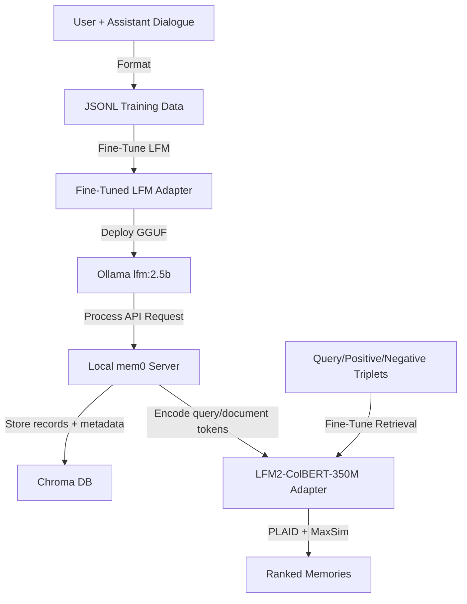

# Track Spec: mem0 Integration Fine-Tuning and Retrieval

## Overview
This track addresses local `mem0-open-mcp` model integration with two distinct LFM roles:

1. **Embedding/retrieval:** `LiquidAI/LFM2-ColBERT-350M` is the pinned mem0 retrieval model.
2. **Fact extraction:** `LiquidAI/lfm2.5-1.2b-instruct` is fine-tuned with LoRA to reliably output memory updates in strict JSON schema format.

`LiquidAI/LFM2-ColBERT-350M` is a late-interaction ColBERT retriever. It must be integrated through a ColBERT adapter or sidecar using token-level embeddings and MaxSim scoring, not as a plain single-vector embedding provider. Chroma can remain the local memory metadata store, but vector scoring must route through the ColBERT index/adapter layer.

## Requirements (MoSCoW)
*   **Must Have:**
    *   mem0 embedding configuration pinned to `LiquidAI/LFM2-ColBERT-350M`.
    *   ColBERT adapter contract for multi-vector token embeddings, PLAID indexing, and MaxSim scoring.
    *   Dataset containing conversational snippets mapped to structured facts.
    *   LoRA adapters trained to output strict JSON schemas containing facts.
    *   Retrieval fine-tuning dataset containing `query`, `positive`, and `negative` triplets.
    *   Integration with local Chroma memory records plus ColBERT retrieval scoring.
*   **Should Have:**
    *   Deduplication reasoning (determining whether a fact is redundant).
    *   Retrieval-quality evaluation on mem0-like query/fact pairs.
*   **Could Have:**
    *   Context-aware classification of facts (e.g. preferences vs. raw system info).
*   **Won't Have:**
    *   Support for remote API-based vector DB targets (local Chroma only).

## Data Contracts
*   **Fact Extraction Input Data Contract:**
    ```json
    {
      "conversation_turn": {
        "user_message": "string",
        "assistant_response": "string"
      }
    }
    ```
*   **Fact Extraction Output Data Contract:**
    ```json
    {
      "extracted_facts": [
        "string"
      ]
    }
    ```
*   **Retrieval Fine-Tuning Triplet Contract:**
    ```json
    {
      "query": "string",
      "positive": "relevant memory text",
      "negative": "irrelevant memory text"
    }
    ```

## Architecture & Integration Design


## Connectivity Configuration
*   **GitHub Setup:**
    *   Repository: `edithatogo/models_lang` (branch: `lfm-mem0-integration`).
*   **Hugging Face Setup:**
    *   Hugging Face repository: `edithatogo/lfm2.5-1.2b-mem0-lora`.
    *   Retrieval base model: `LiquidAI/LFM2-ColBERT-350M`.
