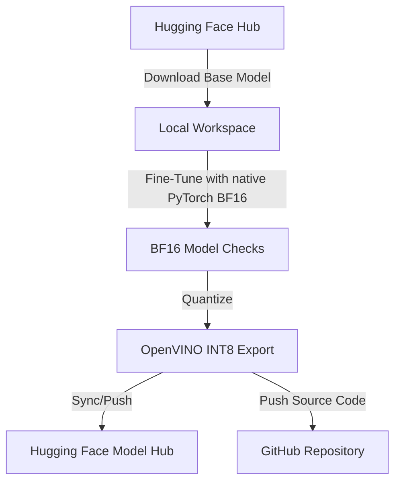

# Track Spec: Intel Chip Optimization Fine-Tuning (Template)

## Overview
This track template defines the pipeline for fine-tuning open-source models on Intel architecture (CPUs, integrated/discrete GPUs) using native PyTorch for training and OpenVINO/NNCF for optimized local CPU inference. Intel Extension for PyTorch (IPEX) is treated as a legacy optional accelerator only when a compatible Linux runtime exists.

## Requirements (MoSCoW)
*   **Must Have:**
    *   Integration with Hugging Face Hub for model downloading/uploading.
    *   Native PyTorch mixed-precision training path (BF16/FP32) with deterministic fallback when IPEX is unavailable.
    *   OpenVINO model quantization (INT8) post-training.
*   **Should Have:**
    *   Hugging Face dataset streaming to minimize memory footprints.
    *   Granular logging of training throughput (tokens/second) and hardware metrics (memory/CPU utilization).
*   **Could Have:**
    *   IPEX optimization on Linux with a pinned compatible PyTorch/IPEX pair.
    *   DeepSpeed CPU Offloading for larger parameters.
*   **Won't Have:**
    *   NVIDIA CUDA-specific kernels (strictly CPU/Intel GPU optimized).

## Data Contracts
*   **Input Data Contract:**
    ```json
    {
      "source": "huggingface_dataset",
      "format": "parquet/jsonl",
      "schema": {
        "instruction": "string",
        "input": "string",
        "output": "string"
      }
    }
    ```
*   **Output Data Contract:**
    ```json
    {
      "artifacts": {
        "lora_weights": "dir/adapter_config.json",
        "quantized_openvino_model": "dir/openvino_model.xml",
        "huggingface_repo": "string"
      }
    }
    ```

## Architecture & Integration Design


## Connectivity Configuration
*   **GitHub Setup:**
    *   Repository sync configured under `edithatogo/` namespace.
    *   Version control commits include `.xml` schema mappings but exclude weights files via `.gitignore`.
*   **Hugging Face Setup:**
    *   Token validation using local `hf` CLI credentials file at `~/.cache/huggingface/token`.
    *   Model namespace targeted to `edithatogo/`.
